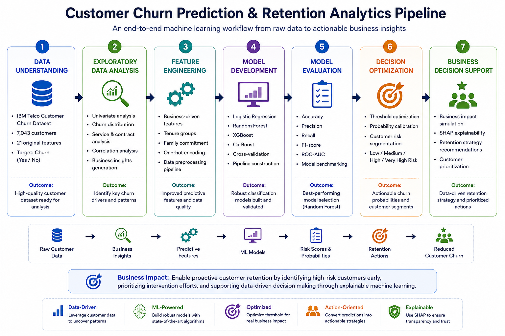

# Customer Churn Risk Prediction & Retention Analytics
An end-to-end machine learning project that predicts customer churn and demonstrates how predictive analytics can support business-driven retention strategies.


## Project Pipeline



## Executive Summary

This project develops an end-to-end machine learning pipeline to predict customer churn and transform predictions into actionable business decisions.

Highlights include:

- Built and benchmarked four machine learning models
- Selected Random Forest based on business-oriented evaluation
- Created probability-based customer risk segmentation
- Simulated business impact for retention campaigns
- Applied SHAP explainability to interpret model predictions

The project demonstrates the complete lifecycle of a production-oriented data science solution, from exploratory analysis to business decision support.

## Project Overview

Customer churn is one of the most important challenges faced by subscription-based businesses. Acquiring new customers is significantly more expensive than retaining existing ones, making early identification of customers at risk of leaving a valuable business capability.

This project develops an end-to-end machine learning pipeline to predict customer churn using the IBM Telco Customer Churn dataset. Beyond predictive modelling, the project focuses on business interpretation by incorporating:

- Business-driven feature engineering
- Model benchmarking
- Threshold optimisation
- Customer risk segmentation
- Business impact simulation
- SHAP explainability

The objective is not only to predict churn accurately but also to demonstrate how machine learning can support customer retention strategies in a real business environment.

## Project Components

- Exploratory Data Analysis (EDA)
- Business-driven Feature Engineering
- Multiple ML Algorithms
  - Logistic Regression
  - Random Forest
  - XGBoost
  - CatBoost
- Model Benchmarking
- Threshold Optimisation
- Customer Risk Segmentation
- Business Impact Simulation
- SHAP Explainability

## Technologies

**Languages & Libraries**


## Model Performance

| Model               |  Accuracy | Precision |    Recall |        F1 |   ROC-AUC |
| ------------------- | --------: | --------: | --------: | --------: | --------: |
| Logistic Regression |     0.733 |     0.498 | **0.791** |     0.612 |     0.842 |
| Random Forest       |     0.762 |     0.535 |     0.781 | **0.635** | **0.845** |
| XGBoost             |     0.798 |     0.644 |     0.537 |     0.586 |     0.843 |
| CatBoost            | **0.805** | **0.664** |     0.535 |     0.593 |     0.844 |

>**Selected model: Random Forest, chosen because it achieved the strongest balance between precision, recall and F1-score for customer retention.**

## 📈 Key Results & Visualizations

### 1. Key Exploratory Finding


Month-to-month customers exhibit substantially higher churn than customers on one-year or two-year contracts, establishing contract commitment as one of the clearest retention indicators.

### 2. Model Benchmarking


Random Forest was selected because it maintained high recall while achieving the highest F1-score, providing the best balance between detecting churners and limiting unnecessary retention interventions.

### 3. What Drives Customer Churn?

Contract type, customer tenure, pricing, internet service, and access to support services emerged as the strongest predictors. Month-to-month customers and customers early in their lifecycle represent particularly important retention segments.

### 4. Probability-Based Customer Risk Segmentation


The model successfully separates customers into meaningful risk groups. Observed churn rises from **5.7%** in the Low-Risk segment to **74.2%** in the Very-High-Risk segment, enabling retention teams to prioritise resources according to customer risk.

### 5. Explainable AI with SHAP


## Business Insights

The analysis demonstrates how churn predictions can support customer retention strategies by enabling:

- Early identification of high-risk customers
- Prioritised allocation of retention resources
- Explainable prediction using SHAP
- Data-driven retention decision making

## Repository Structure

```text
Customer-Churn-Prediction/
│
├── data/
│   ├── raw/
│   └── processed/
│
├── figures/
│   ├── churn_by_contract.png
│   ├── model_comparison.png
│   ├── feature_importance.png
│   ├── risk_segmentation.png
│   └── shap_summary.png
│
├── models/
│   ├── logistic_regression_pipeline.pkl
│   ├── random_forest_pipeline.pkl
│   ├── xgboost_pipeline.pkl
│   └── catboost_pipeline.pkl
│
├── notebooks/
│   ├── 01_Exploratory_Data_Analysis.ipynb
│   ├── 02_Feature_Engineering_and_Model_Development.ipynb
│   └── 03_Model_Evaluation_and_Business_Insights.ipynb
│
├── src/
│
├── README.md
└── requirements.txt

```
> The repository is organised to separate exploratory analysis, model development, trained models and supporting visualisations, making the workflow easy to follow and reproduce.

## Notebook Guide

| Notebook | Purpose |
|----------|---------|
| `01_Exploratory_Data_Analysis.ipynb` | Explores churn patterns across customer demographics, contracts, services, tenure and billing behaviour |
| `02_Feature_Engineering_and_Model_Development.ipynb` | Builds business-driven features, preprocessing pipelines and benchmarks multiple classification models |
| `03_Model_Evaluation_and_Business_Insights.ipynb` | Optimises the decision threshold, segments customers by risk, simulates business impact and explains predictions using SHAP |

## Dataset

The project uses the IBM Telco Customer Churn dataset, containing customer demographics, account information, subscribed services, billing characteristics and churn outcomes.

The modelling target is:

- `Churn = 1`: Customer left the provider
- `Churn = 0`: Customer remained with the provider

- Customers: 7,043
- Target churn rate: approximately 26.5%


## Business Impact

The business-impact simulation demonstrates how churn probabilities could support retention-budget allocation.

The simulation uses hypothetical assumptions for:

- Retention campaign cost
- Annual customer value
- Retention success rate

These figures are illustrative and should not be interpreted as an estimate of actual financial return.

## Installation

Clone the repository:

```bash
git clone https://github.com/Saptaparnineogi/Customer-Churn-Prediction.git
cd Customer-Churn-Prediction
````
````
conda create -n churn-prediction python=3.11
conda activate churn-prediction
````
````
pip install -r requirements.txt
````

### How to Run

Launch Jupyter Notebook:

```bash
jupyter notebook

```

## Limitations

- The dataset is relatively small and represents a simplified telecom use case.
- Historical campaign-response data and customer lifetime value were unavailable.
- The financial-impact simulation uses illustrative assumptions.
- Feature importance and SHAP values explain model behaviour but do not establish causal relationships.
- The model has not been validated on an external or more recent customer population.


## Future Improvements

- Probability calibration
- Customer lifetime value modelling
- Profit-based threshold optimisation
- Hyperparameter tuning with Optuna
- Model monitoring and drift detection
- Deployment through a Streamlit application or REST API


## Conclusion

This project demonstrates an end-to-end machine learning workflow that extends beyond predictive modelling to business decision support.

By combining robust feature engineering, model benchmarking, explainable AI, and business-oriented evaluation, it illustrates how churn prediction can be translated into actionable customer retention strategies.
