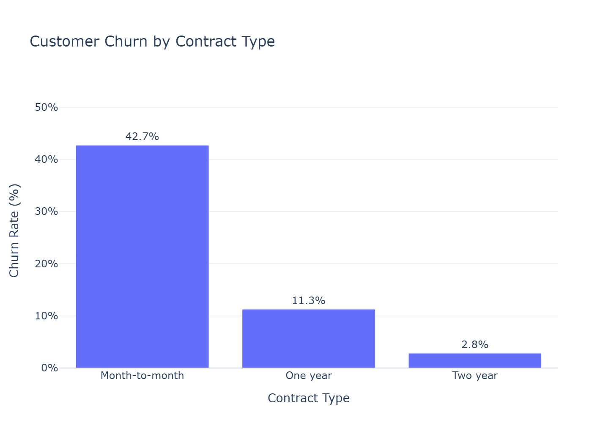
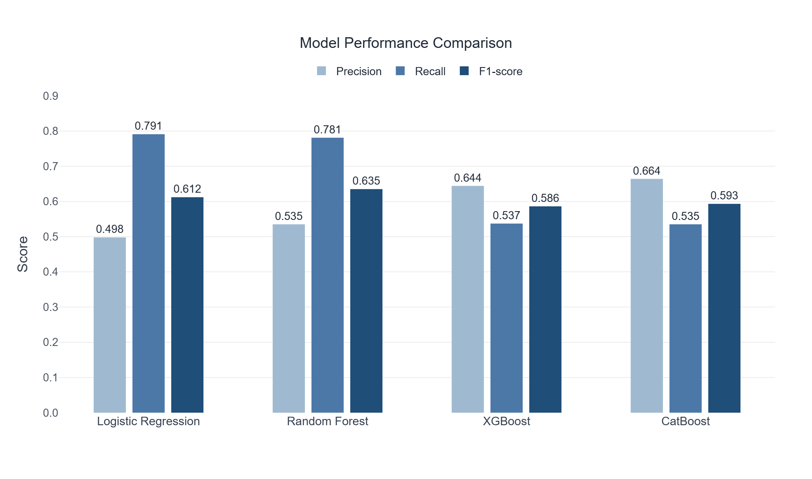
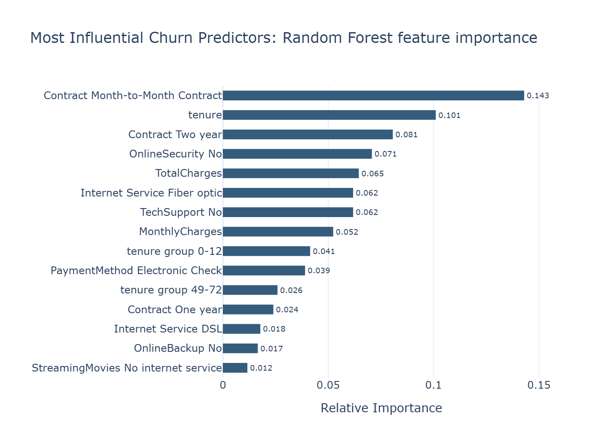
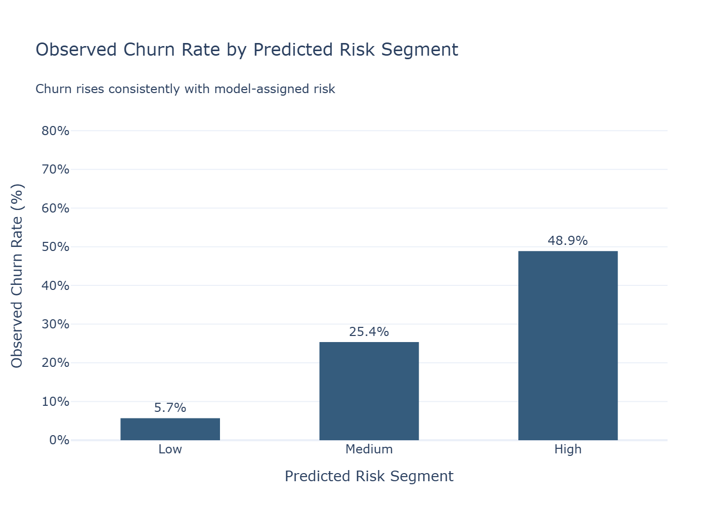
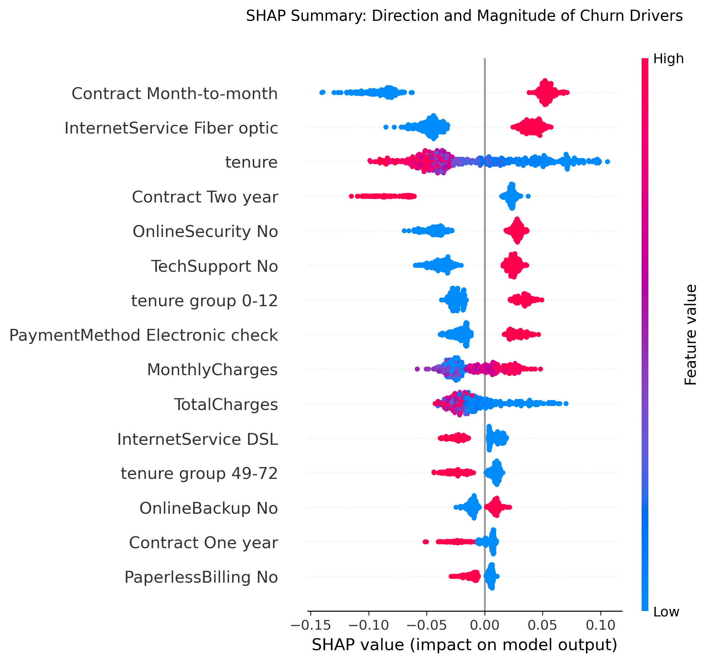

# Customer Churn Risk Prediction & Retention Analytics
An end-to-end machine learning project that predicts customer churn and demonstrates how predictive analytics can support business-driven retention strategies.

## Project Overview

Customer churn is one of the most important challenges faced by subscription-based businesses. Acquiring new customers is significantly more expensive than retaining existing ones, making early identification of customers at risk of leaving a valuable business capability.

This project develops an end-to-end machine learning pipeline to predict customer churn using the IBM Telco Customer Churn dataset. Beyond predictive modelling, the project focuses on business interpretation by incorporating:

- Business-driven feature engineering
- Model benchmarking
- Threshold optimisation
- Customer risk segmentation
- Business impact simulation
- SHAP explainability

The objective is not only to predict churn accurately but also to demonstrate how machine learning can support customer retention strategies in a real business environment.

## Key Features

- Exploratory Data Analysis (EDA)
- Business-driven Feature Engineering
- Multiple ML Algorithms
  - Logistic Regression
  - Random Forest
  - XGBoost
  - CatBoost
- Model Benchmarking
- Threshold Optimisation
- Customer Risk Segmentation
- Business Impact Simulation
- SHAP Explainability

 Raw Data
    │
    ▼
EDA
    │
    ▼
Feature Engineering
    │
    ▼
Preprocessing Pipeline
    │
    ▼
Model Training
    │
    ▼
Model Evaluation
    │
    ▼
Threshold Optimisation
    │
    ▼
Risk Segmentation
    │
    ▼
Business Impact
    │
    ▼
SHAP Explainability

| Model               |  Accuracy | Precision |    Recall |        F1 |   ROC-AUC |
| ------------------- | --------: | --------: | --------: | --------: | --------: |
| Logistic Regression |     0.733 |     0.498 | **0.791** |     0.612 |     0.842 |
| Random Forest ⭐     |     0.762 |     0.535 |     0.781 | **0.635** | **0.845** |
| XGBoost             |     0.798 |     0.644 |     0.537 |     0.586 |     0.843 |
| CatBoost            | **0.805** | **0.664** |     0.535 |     0.593 |     0.844 |

## 📈 Key Results & Visualizations

### Key Exploratory Finding

Month-to-month customers exhibit substantially higher churn than customers on one-year or two-year contracts, establishing contract commitment as one of the clearest retention indicators.

### Model Benchmarking

Random Forest was selected because it maintained high recall while achieving the highest F1-score, providing the best balance between detecting churners and limiting unnecessary retention interventions.

### What Drives Customer Churn?

Contract type, customer tenure, pricing, internet service, and access to support services emerged as the strongest predictors. Month-to-month customers and customers early in their lifecycle represent particularly important retention segments.

### Probability-Based Customer Risk Segmentation

The model successfully separates customers into meaningful risk groups. Observed churn rises from **5.7%** in the Low-Risk segment to **74.2%** in the Very-High-Risk segment, enabling retention teams to prioritise resources according to customer risk.

### Explainable AI with SHAP

Global SHAP explanations show both the magnitude and direction of the features influencing churn predictions.

## Business Insights

The analysis identified several customer characteristics associated with increased churn risk.

Key findings include:

- Month-to-month contracts are the strongest predictor of churn.
- Customers within their first year show substantially higher churn rates.
- Lack of Online Security and Tech Support increases churn risk.
- Fiber optic customers demonstrate higher churn than DSL customers.
- Probability-based customer segmentation enables targeted retention strategies rather than broad campaigns.
